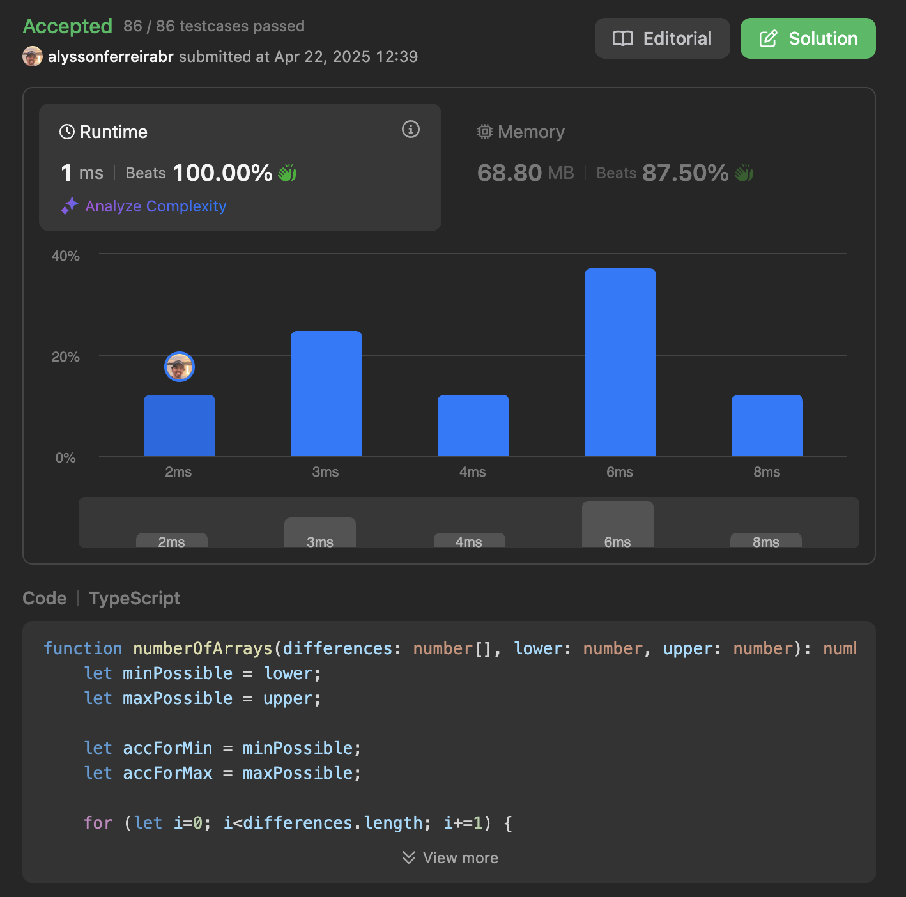

## The Problem
Count the Hidden Sequences

You are given a 0-indexed array of n integers differences, which describes the differences between each pair of consecutive integers of a hidden sequence of length (n + 1). More formally, call the hidden sequence hidden, then we have that differences[i] = hidden[i + 1] - hidden[i].

You are further given two integers lower and upper that describe the inclusive range of values [lower, upper] that the hidden sequence can contain.

For example, given differences = [1, -3, 4], lower = 1, upper = 6, the hidden sequence is a sequence of length 4 whose elements are in between 1 and 6 (inclusive).
[3, 4, 1, 5] and [4, 5, 2, 6] are possible hidden sequences.
[5, 6, 3, 7] is not possible since it contains an element greater than 6.
[1, 2, 3, 4] is not possible since the differences are not correct.
Return the number of possible hidden sequences there are. If there are no possible sequences, return 0.

 

Example 1:

Input: differences = [1,-3,4], lower = 1, upper = 6
Output: 2
Explanation: The possible hidden sequences are:
- [3, 4, 1, 5]
- [4, 5, 2, 6]
Thus, we return 2.
Example 2:

Input: differences = [3,-4,5,1,-2], lower = -4, upper = 5
Output: 4
Explanation: The possible hidden sequences are:
- [-3, 0, -4, 1, 2, 0]
- [-2, 1, -3, 2, 3, 1]
- [-1, 2, -2, 3, 4, 2]
- [0, 3, -1, 4, 5, 3]
Thus, we return 4.
Example 3:

Input: differences = [4,-7,2], lower = 3, upper = 6
Output: 0
Explanation: There are no possible hidden sequences. Thus, we return 0.
 

Constraints:

n == differences.length
1 <= n <= 105
-105 <= differences[i] <= 105
-105 <= lower <= upper <= 105

## Solution
My idea here to solve this issue is based on a mathematical approach, that is guaranteed to work, since it is checked over every step of the algorithm iteration.
The idea is to verify if the lower and upper bounds can be a valid number as starting sequence.
At every iteration, apply the number contained in the difference array, and check if the upper and lower bounds are being obeyed.
If there are any overflows happening, take the exact overflow amount into consideration and reduce the spectrum of possible sequences in that range.
No recomputation is needed because of the aggregate sum auxiliar variables are updated precisely taking the overflow in that step into account.
At the end of the algorithm, the lower range and upper range, if valid, shows automatically that there are a range of possible numbers to be a solution to the problem.

## Solution analysis
The asymptotic order of complexity of the solution proposed is:
- O(N) in terms of computing processing, since it visits once and only once each element in the input array.
- O(1) in terms of memory, since it allocates a fixed number of variables. Even though we have the auxiliriary `overflow` variable, it's a temporary one existing only inside of the if loop, so at any given time in the for loop, we have a maximum of one variable in memory.

## SOLUTION Performance

